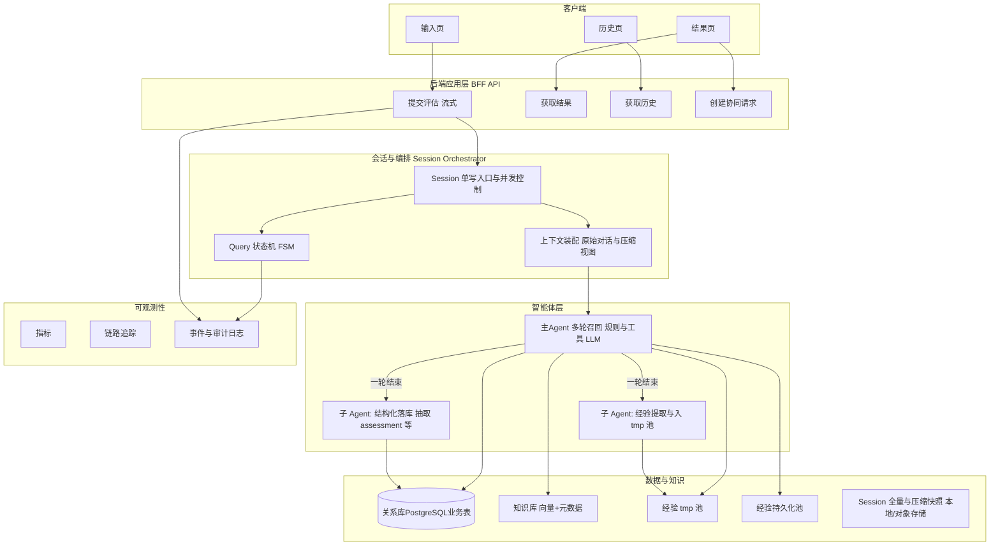
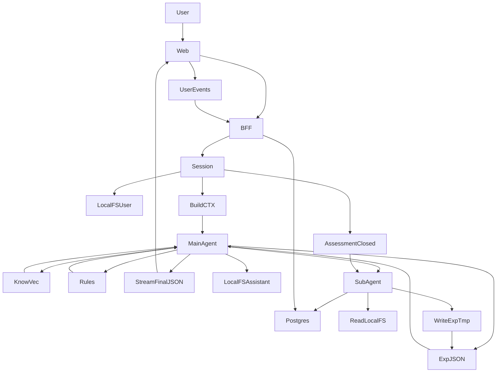
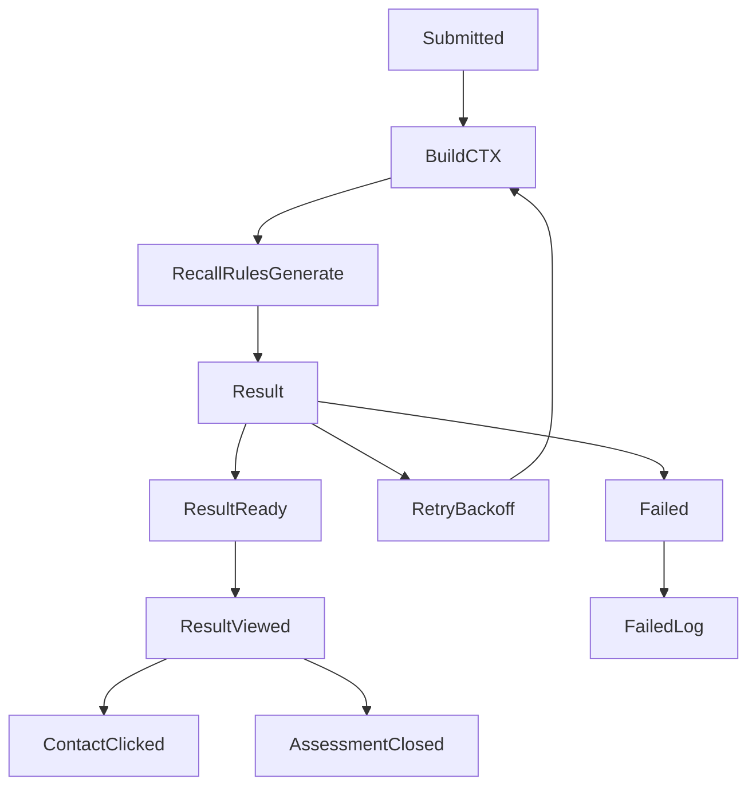
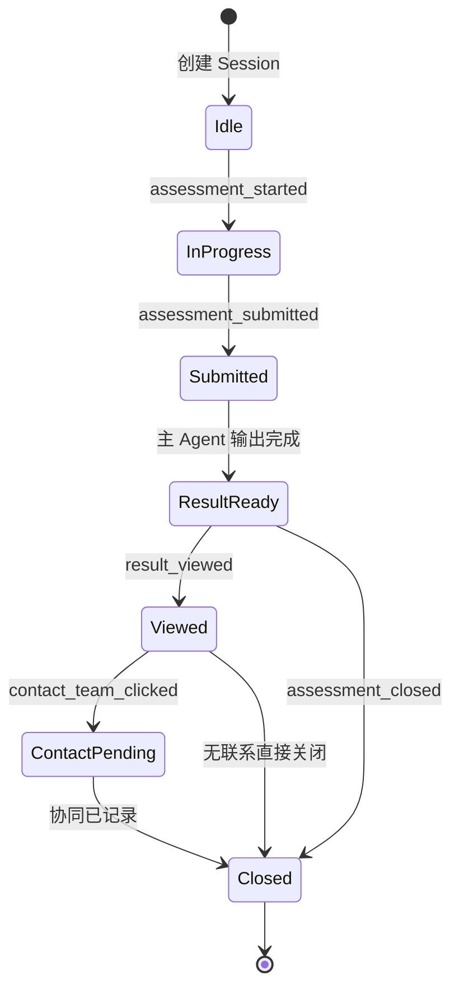
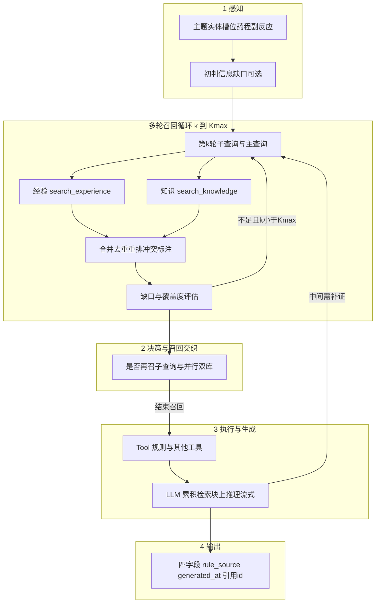
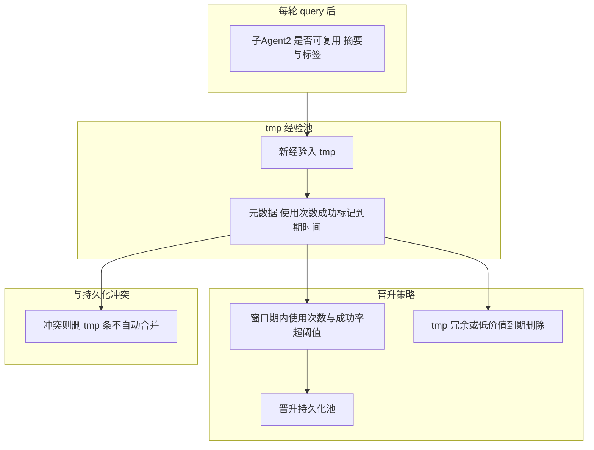
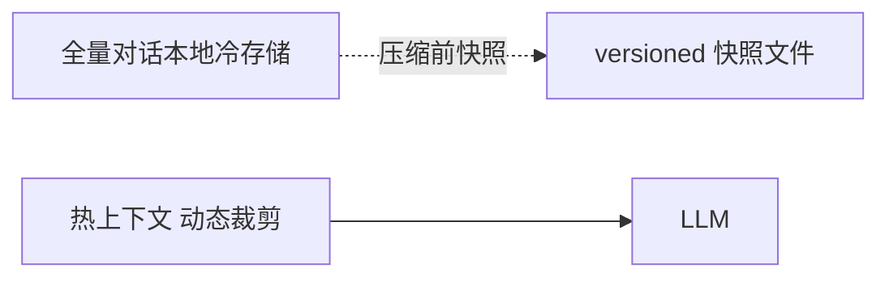

# 乳腺癌副作用评估原型 — 系统设计与架构说明

> 基于 `Feature.md` 需求整理。本文档描述目标形态、技术选型建议、系统架构、数据流、智能体「感知-决策-执行-学习」闭环、会话/状态/可观测性/经验池与压缩策略。  
> 文档版本：1.10 | 状态：设计稿（可随实现细化）| v1.10 **§4 重写为单张 Mermaid graph TD**：只使用最小语法 `graph TD`、`-->`、英文节点，避免 Typora Mermaid 解析错误。

---

## 1. 项目目标与范围

**目标**：实现最小可运行原型（MVP），面向乳腺癌相关用户，收集**副作用相关自然语言描述**，系统输出：

| 输出项 | 说明 |
|--------|------|
| 风险等级 | 高 / 中 / 低（与规则层绑定） |
| 下一步建议 | 可执行、可理解的操作建议 |
| 是否建议联系团队 | 是 / 否（与规则、agent 综合结论一致） |
| 简单依据说明 | 面向用户的简短理由 |
| 引用与审计 | 命中规则 ID/摘要、生成时间；必要时附知识库片段引用 |

**规则层（必须落地为可解释逻辑）**：

- **高风险**：立即线下就医 / 24h 内联系团队  
- **中风险**：联系团队或密切观察  
- **低风险**：继续观察与记录  

**非目标（MVP 可弱化）**：临床诊断；替代线下就医；未经验证的医学建议自动执行。

---

## 2. 功能与接口清单（与需求对齐）

### 2.1 前端（三页）

| 页面 | 职责 |
|------|------|
| 用户输入页 | 采集副作用描述；可选历史会话入口；支持流式展示结果区域 |
| 结果页 | 展示四项结构化结果、依据、规则引用、时间戳；操作「联系团队」等 |
| 历史记录页 | 拉取/展示历史评估摘要；可跳转详情或只读结果 |

### 2.2 后端 API（四个对外能力）

> 与需求「提交评估 / 获取结果 / 获取历史 / 创建协同请求」一一对应；具体路径可在实现时 REST 化，例如 `/api/assessments` 等。

| API | 职责 |
|-----|------|
| 提交评估 | 创建或绑定 **Session**，提交用户当前 query；触发 agent 管道；**支持 SSE/WebSocket 流式**返回 token/片段与最终 JSON |
| 获取结果 | 按 `session_id` / `assessment_id` 取结构化结果、引用、时间 |
| 获取历史 | 分页列表 + 必要筛选（时间、风险等级等） |
| 创建协同请求 | 用户主动发起「联系团队」：写事件、可排队通知、与 assessment 关联 |

**Session 要求**：每个用户输入进入后端时**新建或复用单活跃 Session**（按产品策略二选一；建议「同一会话多轮」复用、不同 Tab 可新建），避免多路并发写同一逻辑队列互相覆盖。

### 2.3 数据存储（最小实体）

至少包含并可在审计中还原：

- **assessment**：一次可评估单元（可映射为 session 内一轮 query 或一个 assessment 记录）  
- **advice**：结构化建议文本及版本  
- **evidence**：证据项（可含用户原文摘要、知识库片段、模型摘录）  
- **rule source**：命中的规则 ID、规则版本、展示名  
- **event log**：全链路埋点 + 重要业务事件（见下节）

### 2.4 可观测性（至少 5 个事件）

| 事件 | 含义 |
|------|------|
| `assessment_started` | 开始一次评估（session/query 级） |
| `assessment_submitted` | 用户提交描述 |
| `result_viewed` | 结果页/结果区域被展示或聚焦 |
| `contact_team_clicked` | 用户点击联系团队（与协同请求可联动） |
| `assessment_closed` | 会话/评估阶段结束或归档 |

> 实现上可统一为 `event_type` + `payload` + `session_id` + `ts`，写入 **event log** 表或时序/日志系统。

### 2.5 审计要求

每次返回结果必须能说明：

- **命中了哪条（哪些）规则**（`rule source` 可追溯）  
- **生成时间**（服务端 UTC + 可展示本地时区）

---

## 3. 系统总览架构

下图描述：**Web 前端 ↔ API 网关/应用服务 ↔ 会话与编排器 ↔ 主 Agent + 子 Agent ↔ 数据与可观测**。

**组件关系（文字摘要）**：

- **BFF** 对前端暴露 4 个能力；流式通道与同一套 Session 强绑定。  
- **Session Orchestrator** 是后端「单写」入口：同一 `session_id` 内 query 串行化（队列），避免并发干扰。  
- **主 Agent** 在单轮用户问题内对 **经验库与知识库进行多轮召回**（可改写子查询/扩展主题，直至满足覆盖度或达到轮次上界），再经规则层、多步 tool 与最终 JSON 输出；**子 Agent1** 负责从对话中抽取五类字段并写库；**子 Agent2** 负责可复用经验与 tmp 池治理。  
- **Session 存储** 既保存完整历史（审计与复盘），又向 LLM 提供压缩后的 `CTX`。

---

## 4. 请求与数据流（端到端）

本节按 **控制面**（请求/编排/状态）与 **数据面**（各类数据最终落在哪种介质）描述一条评估请求的端到端路径。介质分工与 §3 中 **DB / KB / Exp* / SessStore** 一致：**关系型业务 → 数据库 `D`**，**经验条目 → JSON 文件池 `E`**（tmp + 持久分区），**知识 chunk → 向量库 `K`**，**完整对话与 tool 轨迹 → 本地文件 `FS`**（实现上可对应 §9 全量/快照/manifest 三层，此处序列图统称 `FS`）。

**端到端数据流图（Typora Mermaid 最小语法）**：

**主链路错误（编排视角）**：

**数据流要点**：

1. **单写入口**：用户 query 经 **API → `S`** 入队；同一 `session_id` 内由 `S` 串行化，避免并发写乱 **FSM 与 FS**。  
2. **CTX 装配**：`S` 从 **FS**（及内存中的 session 热缓存）装配 `CTX` 再交给 **`A`**；**不**把整段对话主存放在关系库大字段。  
3. **多轮召回（读路径）**：`A` 循环读 **`E`**（JSON 文件池，多 query）与 **`K`**（向量 + 元数据）；双轨可并行、可跨轮交替，详见 §6。  
4. **规则**：`A` ↔ **`R`**（多为进程内或配置驱动）；最终输出前建议再做一次 **确定性规则校验**，结果写入 JSON 与后续 `D` 中的 `rule_hits` 对齐。  
5. **用户可见输出**：`A` → **FE** 流式 + **最终 JSON**（含 `rule_source`、`generated_at`、经验/知识 **引用 id**）。  
6. **写路径 — 对话**：主链路中 **`S`/`A` → FS** 追加消息与 tool 记录，保证事后可复盘、子 Agent 可重放。  
7. **写路径 — 业务表**：**最终 JSON 到达 FE 之后**（或并行不阻塞首包），**`A` 异步触发 `P` → `D`** 写入 assessment 等；失败走队列/死信（§7），**不回滚**用户已看到的流式结论 unless 产品明确要求。  
8. **写路径 — 经验学习**：**会话关闭 `assessment_closed`** 后 **`S` 异步入队 `P`**，`P` 读 **FS** 全量或快照、写 **`E`**（tmp JSON）并必要时补写 **`D`**；与「每轮结束后即时落库」可并存（幂等键去重）。  
9. **协同与埋点**：`result_viewed`、`contact_team_clicked` 等经 **API → `D`**（event 表或等价）持久化，与 §2.4 对齐。

---

## 5. Session、Query 状态机与事件映射

**Session**：标识一次多轮咨询边界；**Query**：Session 内单轮问题与回答。

**与 5 个埋点事件对应关系**：

- `assessment_started`：进入 `InProgress` 或首次收到评估请求时。  
- `assessment_submitted`：用户文本通过校验正式入队。  
- `result_viewed`：前端曝光结果（可用 IntersectionObserver 或路由进入结果页）。  
- `contact_team_clicked`：点击联系团队。  
- `assessment_closed`：会话结束、超时、或用户主动结束。

> 若产品希望「同一会话多轮 query」，可对 **每个 query 子状态**再建一层 FSM，父 Session 仅维护 `active_query_id` 与总生命周期。

---

## 6. 主 Agent 内部：多轮经验/知识召回 + 动态 Prompt + 工具循环

本节的「多轮」指 **在同一用户 query 的一次推理过程内**，对 **经验库** 与 **知识库** 进行 **可重复的检索回合**；每一轮可更新查询表述、子主题、过滤条件或 top-K，**不是**指用户多轮聊天（多轮聊天由 Session 承载）。

### 6.1 多轮召回策略

- **为何要多轮**：用户描述常为口语化、一次检索难以同时覆盖「药物-症状-时序-严重性」等维度；**经验**与**知识**的**有效关键词往往不同**（经验偏案例模式，知识偏指南条款），分轮检索能显著提高召回率与可解释引用数。  
- **首轮**：对用户原文做向量化 + 元数据初筛；**经验**优先于 tmp+持久化池，**知识**可放宽 top-K 以定边界。  
- **后续轮**（由决策器触发）：
  - **查询改写**：根据首轮缺口生成子查询（例如单独拉「某化疗药 + 神经毒性」或「需急诊征象」）。  
  - **拆主题**：主诉拆成 2–3 个子问题分别检索，再合并。  
  - **由规则驱动**：中/高风险候选项触发「加深检索」的固定 query 模板。  
  - **由 LLM 在 tool 中返回 `need_more: true` + `suggested_queries[]`**，编排器最多执行到 `K_max` 轮。  
- **经验与知识双轨**：**每一轮**内均可同时调用两路检索；亦允许**轮间交替**（例如第 1 轮只定主题，第 2 轮经验细化、第 3 轮知识补指南）。实现上二轨并行更省延迟。  
- **停止条件**（满足其一即结束多轮部分，进入规则校验与成文）：
  - 覆盖度/置信度 **≥ 设定阈值**；  
  - **达到** `K_max`（如 3～5，可配置）；  
  - 本轮与上轮 **检索结果无新增**（早停）。  

### 6.2 与「感知-决策-执行-学习」的衔接

- **感知**：不只在第 0 步做一次；每轮召回前可**重新**提取子主题与槽位。  
- **决策**：在每一轮后判断 **是否再召回、下一 queries、是否调用规则**；在最终成文前再决策一次 **是否需补充引用**（若否，可拒绝再调库以控成本）。  
- **执行**：多轮 `search_*` 与 `evaluate_rules` 的 tool 调用序列写入 Session（含 **压缩策略中的 tool 全量**）。  
- **学习**：见 §7，仍在一轮 user query **结束后**由子 Agent 总结入池，与多轮召回正交。

### 6.3 实现要点（与单轮相比的补充）

- **经验库先查、知识库跟进的优先级**在首轮仍建议保持；**后续轮**二者平等，由覆盖度决定侧重。  
- **动态 Prompt**：每轮将 **新命中的块** 追加到 `retrieval` 区（注意 token 预算；可摘要旧块）。  
- **工具（示例）**：`search_knowledge` | `search_experience` | `evaluate_rules` | `get_clinical_criteria`；多轮时 tool 的 **入参**应记录 `round` 与 `query_variant`，供审计与 `evidence` 表关联。  
- **流式**：可在 UI 上展示「正在检索相关经验/知识(第 n 轮)」等**阶段事件**（非需求中的 5 个埋点，属可选 UX 与内部 trace，见可观测性扩展）。  
- **防冗余**：多轮合并时 **去重**（同 chunk id）、**矛盾检测**（知识 vs 经验冲突时标优先级：指南 > 规则 > 经验叙述）。

### 6.4 可观测性（建议扩展，不替代 §2.4 的 5 个必选事件）

内部 trace / 开发环境可记：`recall_round_started`、`recall_round_done`（带 `round`、`source: experience|knowledge`、`result_count`），便于调参与证明「多轮召回」生效。

---

## 7. 子 Agent：落库与经验学习

### 7.1 子 Agent 1 — 结构化持久化

在一轮 **query 结束**后触发，从**完整对话**中抽取并写入（建议幂等 `assessment_id`）：

- `assessment`：患者描述摘要、风险等级、时间戳、session 关联。  
- `advice`：建议正文与版本。  
- `evidence`：引用的知识片段、用户关键句。  
- `rule source`：规则 ID 列表与命中说明。  
- `event log`：必要业务子事件或补偿写入。

可规则 + 小模型 JSON Schema 双保险，**失败**则入死信队列重试，并打 `event log`。

### 7.2 子 Agent 2 — 经验提取与两阶段池

**与需求对齐**：

- **tmp 池**：不解决冲突、允许冗余；与持久化池规则冲突时 **删 tmp 条目**。  
- **持久化池**：经统计阈值晋升；供后续检索优先。  
- **「成功」定义**：需产品定 KPI（如用户未在短时间内重复同诉、或显式「有帮助」、或与人工审核协同）；MVP 可用「未触发高风险误报 + 无即时重复提交」作代理指标。

---

## 8. 上下文压缩策略（>50% 窗口触发）

**触发条件**：当 **Session 可计量 token**（或字符）超过所选用模型**上下文窗口的 50%** 时，触发压缩（可在 query 边界异步执行，下一轮加载压缩视图）。

**保留（不丢语义优先级）**：

1. 初始 `system` / 安全与输出 schema。  
2. **第一轮**用户问题与系统答案（建立基线）。  
3. 全部 **tool 调用记录**（名、入参、出参摘要）。  
4. **最近 3 轮**完整对话。  
5. **中间轮次**：用摘要模型或「结构化要点列表」压成 `compressed_blobs[]`，**原文追加至 Session 全量本地文档**（见下节）。

**加载策略**：新 query 入队时，LLM 侧上下文 = `压缩后摘要 + 保留段 + 最近 3 轮`；**全量**仅在审计、子 Agent、合规导出时使用。

---

## 9. Session 本地持久化

**要求**：每个 Session 的**完整**对话与工具记录落 **本地/对象存储**（实现可选：分文件 JSONL、SQLite、或 S3 兼容桶）。

建议字段：

- `session_id`  
- `messages[]`（含 role、时间、流式可合并为最终条）  
- `tool_calls[]`  
- `compress_versions[]`（每次压缩的指针与 hash）  
- `raw_dump_path`（不可变全量）  

**用途**：审计、子 Agent 输入、争议复盘、与压缩摘要对照。

---

## 10. 技术选型建议（可落地、与架构匹配）

| 层次 | 建议 | 说明 |
|------|------|------|
| 前端 | React / Next.js 或 Vue 3 + Vite | 三页 + SSE 流式；组件化结果卡 |
| API | Node (Fastify/Hono) 或 Python (FastAPI) | 需良好 SSE/异步任务支持 |
| Agent 编排 | 自研状态机 + LangGraph / 轻量自写循环 | 需「单 session 单写」与可恢复 |
| LLM | 可插拔：OpenAI 兼容 / 国内云 API | 流式、JSON mode / tool calling |
| 向量库 | pgvector / Qdrant / Milvus 选一 | 经验 + 知识双 collection 或 metadata 分片 |
| 关系库 | PostgreSQL | 五类业务表 + 事件表 |
| 任务队列 | 内置 asyncio queue（单机）或 Redis Stream（多实例） | 子 Agent 异步 |
| 可观测 | OpenTelemetry + 结构化日志 | 5+ 事件 + trace_id = session / query |
| 存储 | 本地 fs / MinIO | Session 全量与压缩快照 |

---

## 11. 核心数据库表（逻辑模型草案）

> 表名可调整；关键是字段可覆盖审计与经验治理。

- **assessments**：`id, session_id, user_id?, risk, advice_summary, contact_team, generated_at, rule_ids[]`  
- **advices**：`id, assessment_id, content, version`  
- **evidences**：`id, assessment_id, type, text, ref_id`  
- **rule_hits**：`id, assessment_id, rule_id, version, reason`  
- **event_logs**：`id, session_id, type, payload, ts`  
- **experience_tmp / experience_persistent**：向量列 + 标签 JSON + 统计字段 + 过期时间  
- **contact_requests**：`id, session_id, assessment_id?, status, created_at`

---

## 12. 风险、合规与安全（MVP 必提）

- **医疗免责声明**：结果页显式说明「辅助信息，不替代线下诊疗」。  
- **PII**：最小化存用户标识；全量 session 存本地需加密与访问控制。  
- **规则优先**：高敏感词/急症模式优先走**规则高风险**，再允许模型润色。  
- **可观测不记录敏感原文到第三方**：日志脱敏或哈希。

---

## 13. 实现里程碑（建议顺序）

1. 关系库 + 四 API 骨架 + 三页 + `rule engine` 最小规则集。  
2. 主 Agent + **多轮经验/知识召回** + 流式 + 强制输出 schema（含 `rule_source`、`generated_at`、引用 id）。  
3. 五事件埋点 + `event log` 表。  
4. Session 单写 + FSM。  
5. 子 Agent 落库。  
6. 经验 tmp 池 + 晋升与过期。  
7. 对话压缩 + 全量冷存储。  

---

## 14. 附录：与 Feature.md 需求对照

| 需求点 | 本文档对应章节 |
|--------|----------------|
| 三页、四 API | §2.1、§2.2 |
| 风险三层规则 | §1、§6 |
| 五类数据 | §2.3、§11 |
| 五事件 | §2.4、§5 |
| 审计：规则+时间 | §2.5、§6 输出 |
| Session 防并发、流式、多轮经验/知识召回、Agent+工具+动态 prompt | §3、§4、§6 |
| 端到端数据落点(D/E/K/FS)与异步写边界 | §4 |
| 子 Agent 落库、经验池与学习 | §7 |
| Session 全量本地、状态机、压缩 | §5、§8、§9 |
| 感知-决策-执行-学习闭环 | §6、§7 |

---

*本设计文档可直接作为技术评审与排期基线；实现阶段请将 API 路径、表名、与模型/窗口参数写入项目 README 或 OpenAPI 规范中。*
