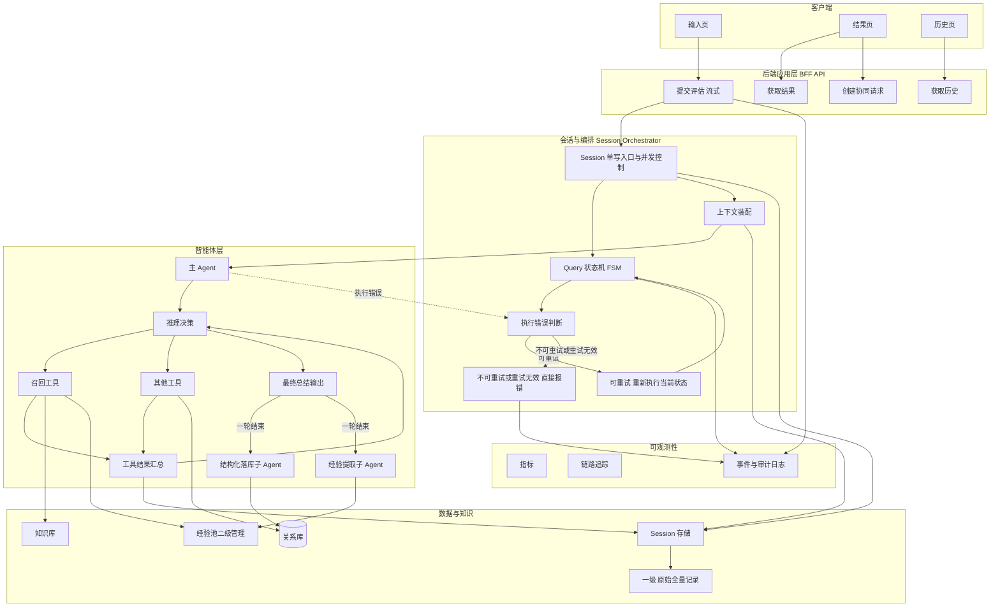
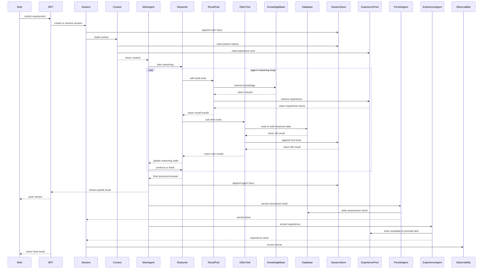

## 架构图

**Web 前端 ↔ API 网关/应用服务 ↔ 会话与编排器 ↔ 主 Agent + 子 Agent ↔ 数据与可观测**。

```mermaid
graph TB
  subgraph Client["客户端"]
    UI_Input["输入页"]
    UI_Result["结果页"]
    UI_History["历史页"]
  end

  subgraph BFF["后端应用层 BFF API"]
    API_Submit["提交评估 流式"]
    API_GetResult["获取结果"]
    API_History["获取历史"]
    API_Contact["创建协同请求"]
  end

  subgraph SessionOrch["会话与编排 Session Orchestrator"]
    SM["Session 单写入口与并发控制"]
    ST["Query 状态机 FSM"]
    CTX["上下文装配"]
    ERR["执行错误判断"]
    RETRY["可重试 重新执行当前状态"]
    FAIL["不可重试或重试无效 直接报错"]
  end

  subgraph Agents["智能体层"]
    MA["主 Agent"]
    AR["推理决策"]
    RTK["召回工具"]
    OTK["其他工具"]
    TR["工具结果汇总"]
    AO["最终总结输出"]
    SA_Persist["结构化落库子 Agent"]
    SA_Exp["经验提取子 Agent"]
  end

  subgraph Data["数据与知识"]
    DB[(关系库)]
    KB["知识库"]
    ExpPool["经验池二级管理"]
    SessStore["Session 存储"]
    SessRaw["一级 原始全量记录"]
  end

  subgraph Obs["可观测性"]
    Metrics["指标"]
    Tracing["链路追踪"]
    LogAgg["事件与审计日志"]
  end

  UI_Input --> API_Submit
  UI_Result --> API_GetResult
  UI_History --> API_History
  UI_Result --> API_Contact

  API_Submit --> SM
  SM --> ST
  SM --> CTX
  ST --> ERR
  ERR -->|可重试| RETRY
  RETRY --> ST
  ERR -->|不可重试或重试无效| FAIL
  CTX --> MA
  MA --> AR
  AR --> RTK
  AR --> OTK
  RTK --> TR
  OTK --> TR
  TR --> AR
  AR --> AO
  RTK --> KB
  RTK --> ExpPool
  OTK --> DB
  MA -.->|执行错误| ERR
  SM --> SessStore
  CTX --> SessStore
  TR --> SessStore
  SessStore --> SessRaw

  AO -->|一轮结束| SA_Persist
  AO -->|一轮结束| SA_Exp
  SA_Persist --> DB
  SA_Exp --> ExpPool
  ST --> LogAgg
  FAIL --> LogAgg
  API_Submit --> LogAgg
```

## 数据流向时序图

```mermaid
sequenceDiagram
    participant UI as Web
    participant API as BFF
    participant SM as Session
    participant CTX as Context
    participant MA as MainAgent
    participant RS as Reasoner
    participant RT as RecallTool
    participant OT as OtherTool
    participant KB as KnowledgeBase
    participant DB as Database
    participant FS as SessionStore
    participant EXP as ExperiencePool
    participant SP as PersistAgent
    participant SE as ExperienceAgent
    participant OBS as Observability

    UI->>API: submit assessment
    API->>SM: create or resume session
    SM->>FS: append user input
    SM->>CTX: build context
    CTX->>FS: read session history
    CTX->>EXP: read experience pool
    CTX-->>MA: return context

    MA->>RS: start reasoning
    loop agent reasoning loop
        RS->>RT: call recall tools
        RT->>KB: retrieve knowledge
        KB-->>RT: return chunks
        RT->>EXP: retrieve experience
        EXP-->>RT: return experience items
        RT-->>RS: return recall results
        RS->>OT: call other tools
        OT->>DB: read or write business data
        DB-->>OT: return db result
        OT->>FS: append tool trace
        FS-->>OT: return file result
        OT-->>RS: return tool results
        RS-->>MA: update reasoning state
        MA->>RS: continue or finish
    end

    RS-->>MA: final structured answer
    MA->>FS: append agent trace
    MA-->>API: stream partial result
    API-->>UI: push stream

    MA->>SP: persist structured result
    SP->>DB: write assessment result
    SP-->>SM: persist done

    MA->>SE: extract experience
    SE->>EXP: write candidate or promote item
    SE-->>SM: experience done

    SM->>OBS: record events
    API-->>UI: return final result
```
