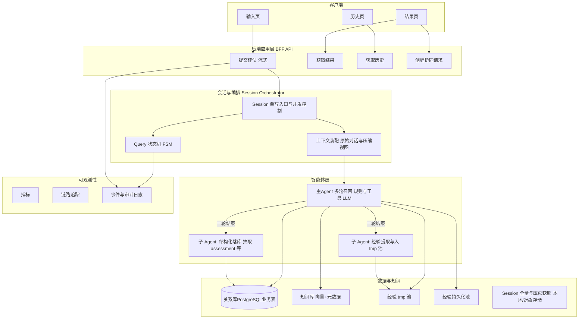
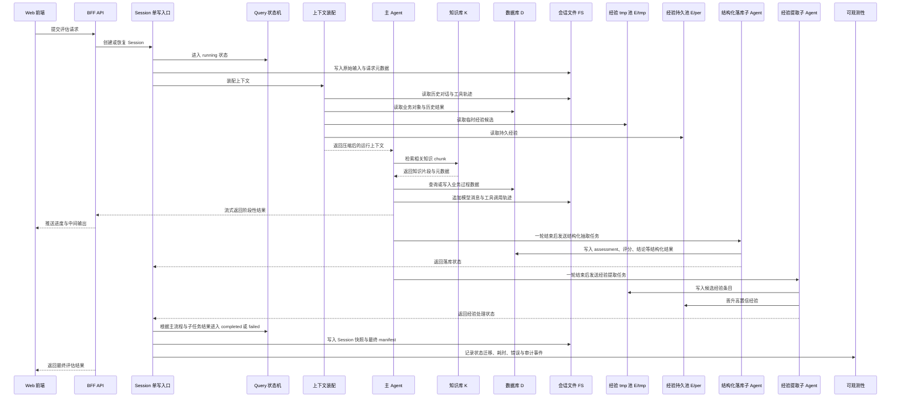

## 架构图
**Web 前端 ↔ API 网关/应用服务 ↔ 会话与编排器 ↔ 主 Agent + 子 Agent ↔ 数据与可观测**。

## 请求与数据流（端到端）

本节按 **控制面**（请求/编排/状态）与 **数据面**（各类数据最终落在哪种介质）描述一条评估请求的端到端路径。介质分工与 §3 中 **DB / KB / Exp* / SessStore** 一致：**关系型业务 → 数据库 `D`**，**经验条目 → JSON 文件池 `E`**（tmp + 持久分区），**知识 chunk → 向量库 `K`**，**完整对话与 tool 轨迹 → 本地文件 `FS`**（实现上可对应 §9 全量/快照/manifest 三层，此处序列图统称 `FS`）。

